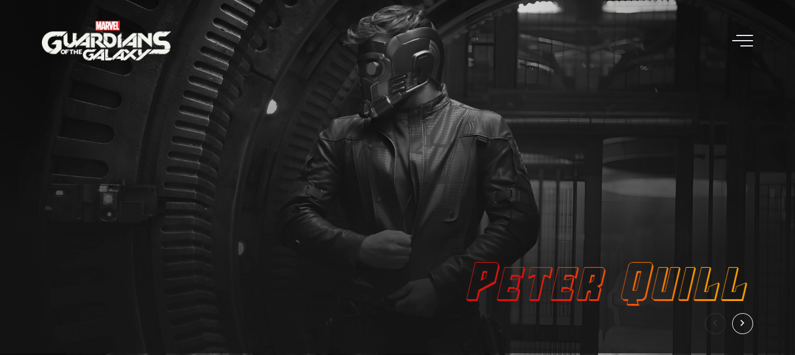

<h1 align="center">
  Guardiões da Galáxia
</h1>

  

## Projeto - Guardiões da Galáxia

Esta landing page apresenta os personagens do filme "Guardiões da Galáxia" com estilos e personalizações. É uma página estruturada e responsiva, seguindo padrões de código limpo.

Tecnologias Utilizadas:
* [HTML (Linguagem de marcação):](https://www.w3schools.com/html/html_intro.asp) Utilizado para estruturar e definir o conteúdo da página, incluindo cabeçalhos, parágrafos, listas e imagens.
* [CSS (Folha de estilos em cascata):](https://www.w3schools.com/css/css_intro.asp) Utilizado para estilizar os elementos da página, definindo cores, tamanhos, fontes e layout, proporcionando uma aparência visualmente atraente.
* [JavaScript:](https://developer.mozilla.org/pt-BR/docs/Web/JavaScript) Utilizado para adicionar interatividade à página, permitindo que o usuário selecione personagens e exiba informações dinamicamente.
* [Google Fonts:](https://fonts.google.com/specimen/Rubik) Utilizado para acessar e aplicar fontes personalizadas aos textos da página, melhorando a estilização e a legibilidade.
* [TinyJPG](https://tinyjpg.com/) e [TinyPNG:](https://tinypng.com/) O site utilizado é uma ferramenta online que comprime imagens JPEG e PNG sem perder muita qualidade. Ele reduz o tamanho dos arquivos de imagem usando algoritmos eficientes de compressão.
* [GitHub Pages:](https://pages.github.com/) Plataforma de hospedagem gratuita para projetos estáticos, permitindo que o site seja acessível na web.

Créditos:
* Criado com base do Canal no YouTube | [Leo Vargas](https://www.youtube.com/watch?v=NdQ9k3SWrRc&ab_channel=LeoVargas)

Implantação do Projeto no GitHub Pages: [Explore o projeto clicando aqui.](https://jcddsj01.github.io/landing-page-guardioes-da-galaxia/)

---

## Project - Guardians of the Galaxy

This landing page features the characters from the movie "Guardians of the Galaxy" with styles and customizations. It is a structured and responsive page, following clean code standards.

Technologies used:
* [HTML (HyperText Markup Language):](https://www.w3schools.com/html/html_intro.asp) Used to structure and define page content, including headings, paragraphs, lists and images.
* [CSS (Cascading Style Sheets):](https://www.w3schools.com/css/css_intro.asp) Used to style the elements of the page, defining colors, sizes, fonts and layout, providing a visually appealing appearance.
* [JavaScript:](https://developer.mozilla.org/pt-BR/docs/Web/JavaScript) Used to add interactivity to the page, allowing the user to select characters and display information dynamically.
* [Google Fonts:](https://fonts.google.com/specimen/Rubik) Used to access and apply custom fonts to page texts, improving stylization and readability.
* [TinyJPG](https://tinyjpg.com/) e [TinyPNG:](https://tinypng.com/) The website used is an online tool that compresses JPEG and PNG images without losing much quality. It reduces the size of image files using efficient compression algorithms.
* [GitHub Pages:](https://pages.github.com/) Free hosting platform for static projects, allowing the website to be accessible on the web.

Credits:
* Created on the basis of the YouTube channel | [Leo Vargas](https://www.youtube.com/watch?v=NdQ9k3SWrRc&ab_channel=LeoVargas)

Project deployment on GitHub Pages: [Explore the project by clicking here.](https://jcddsj01.github.io/landing-page-guardioes-da-galaxia/)
